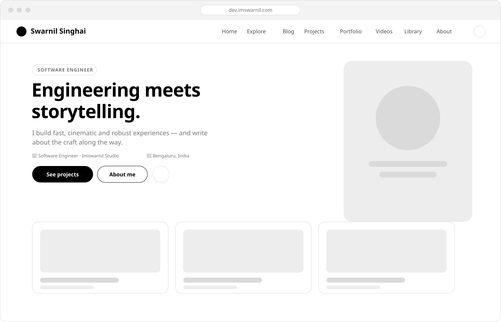
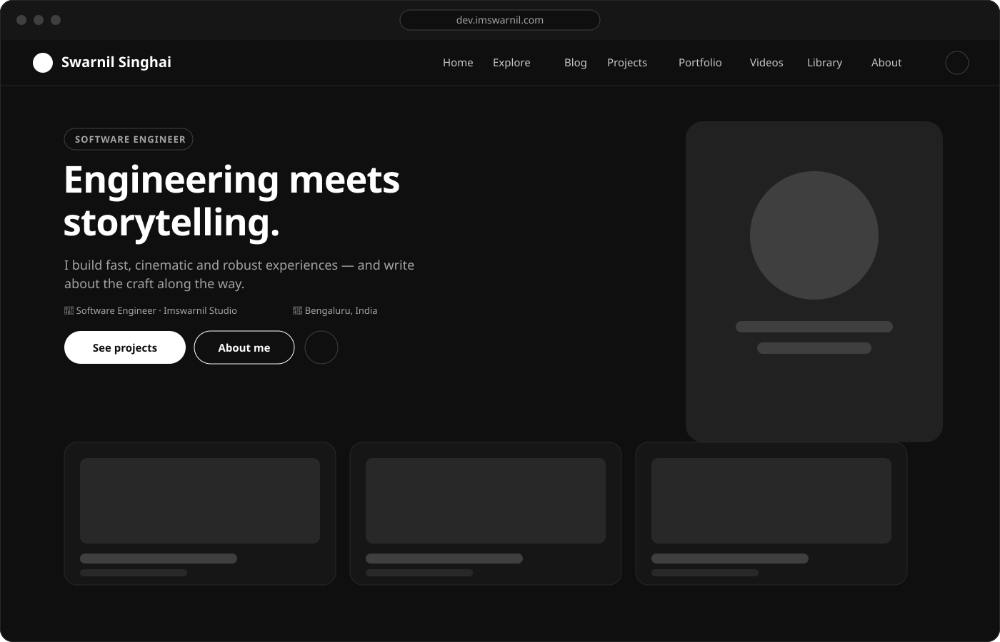

# imswarnil.com

Personal site and blog for **Swarnil Singhai** — software engineer & filmmaker. A Jekyll site with a self-built design system ("**IM CSS**"), six content collections, a resume page, a cross-collection timeline, and a hand-styled tree sitemap.

Live at [dev.imswarnil.com](https://dev.imswarnil.com) · originally forked from the [Alembic](https://alembic.darn.es/) Jekyll theme and rewritten from the ground up since.

<p align="center">
  
</p>
<p align="center">
  
</p>

> These are hand-drawn SVG mockups of the layout (built from the site's real colour tokens), not live screenshots — swap them for actual captures whenever you like; they live at `assets/img/readme/site-preview-{light,dark}.svg`.

## About

Engineering meets storytelling: this repo is both the source for a working personal site and a small, from-scratch CSS framework (`_sass/im/`) built to re-theme entirely at runtime via CSS custom properties — no rebuild needed to flip between light, dark, or system theme.

## Features

- **IM CSS** — a self-contained, token-driven design system (`_sass/im/`). Every colour, space, radius, and motion value is a `--im-*` custom property, so the whole site re-themes live. See [`DESIGN.md`](DESIGN.md) for the full reference.
- **Six content collections** — `posts` (Jekyll's native collection), `projects`, `portfolio`, `videos`, `snippets`, `prompts` — each with its own homepage section style (bento, gallery, ranked "Top picks" list, numbered list, compact, cards) and JSON-LD schema.
- **`/resume/`** — renders structured resume data straight from `_config.yml` (experience, education, skills, projects, awards), with a print-optimised "Save as PDF" mode.
- **`/timeline/`** — a cross-collection timeline. Add `timeline: true` (and optionally `timeline_note:`) to any post/project/video's front matter and it shows up here, most-recent-first.
- **`/sitemap/`** — a tree-style, collapsible sitemap of every page and collection entry, plus JSON-LD (`WebSite` + `ItemList`) describing the same structure for crawlers. (The machine-readable `/sitemap.xml` is generated separately by `jekyll-sitemap`.)
- **`/explore/`** — every collection rendered as one big bento grid.
- **Command-palette search** (`/` to open) plus a full `/search/` page, both reading a generated `assets/search.json` index.
- **Motion system** — dotted/grid background patterns, scroll-reveal via `IntersectionObserver`, native View Transitions on navigation, all gated behind `prefers-reduced-motion` (`_sass/im/_motion.scss`).
- **Configurable chrome** — header (island/full, dropdowns, megamenu), footer (a "big typographic" style with a huge faint wordmark), ads (AdSense, hardened so it can never overflow its container, plus a dismissible floating leaderboard) — all driven by `_config.yml`, no template edits needed for common tweaks.
- **PWA** — offline support via a service worker (`assets/scripts/sw.js`) and an offline fallback page.

## Getting started

```bash
bin/serve      # local dev server + livereload (recommended)
bin/build      # production build into _site/
```

Requires Ruby 3.4 via [chruby](https://github.com/postmodern/chruby) — the macOS system Ruby (2.6) cannot build this site (`sass-embedded`/`google-protobuf` crash on load). `bin/serve`/`bin/build` force the right Ruby onto `PATH` for you. If you switch Ruby versions: `rm -rf vendor/bundle Gemfile.lock && bundle install`.

For a fast SCSS-only sanity check without spinning up Jekyll:

```bash
npx --yes sass@1.77.8 --no-source-map _sass/main.scss /tmp/out.css
```

There's no test suite, linter, or JS build step — content is plain Markdown/Liquid, and Sass is compiled by `jekyll-sass-converter`.

## Project structure

```
_config.yml         Control center — nav, header/footer options, collections, resume data, adsense
_layouts/            default, page, post, resume
_includes/           header, footer, ad, search modal, home/* section renderers, components/* shortcodes
_sass/im/            the IM CSS framework — tokens, base, navbar, hero, components, motion, resume, sitetree…
_posts/               blog posts (Jekyll's native collection), YYYY-MM-DD-slug.md
_projects/ _portfolio/ _videos/ _snippets/ _prompts/   the other five collections
assets/               styles, scripts, images, search index
```

Full architecture notes — collection wiring, layout decisions, known gotchas — live in [`CLAUDE.md`](CLAUDE.md). Design tokens, motion conventions, and the shortcode component reference live in [`DESIGN.md`](DESIGN.md).

## Content collections

| Collection | Directory | Landing page | Homepage style |
|---|---|---|---|
| Blog | `_posts/` | `/blog/` | Numbered list |
| Projects | `_projects/` | `/projects/` | Bento grid |
| Portfolio | `_portfolio/` | `/portfolio/` | Gallery |
| Videos | `_videos/` | `/videos/` | Ranked "Top picks" list |
| Snippets | `_snippets/` | `/snippets/` | Compact list |
| Prompts | `_prompts/` | `/prompts/` | Card grid |

Every entry gets `layout: post` by default (see `defaults:` in `_config.yml`), and JSON-LD structured data matching its collection's configured `schema:` (e.g. `BlogPosting`, `VideoObject`, `CreativeWork`).

## Deployment

Pushing to `main` triggers `.github/workflows/jekyll.yml`, which builds with Ruby 3.1 in production mode and deploys `_site/` to GitHub Pages.

## Credits

- Forked from [Alembic](https://alembic.darn.es/) by [David Darnes](https://darn.es/) — the original theme scaffolding and a few shortcode includes are still in here, even though the styling layer (IM CSS) is a full rewrite.
- Icons by [Phosphor Icons](https://phosphoricons.com/).
- Typeface: [Geist](https://vercel.com/font).

## License

[MIT](LICENSE)
